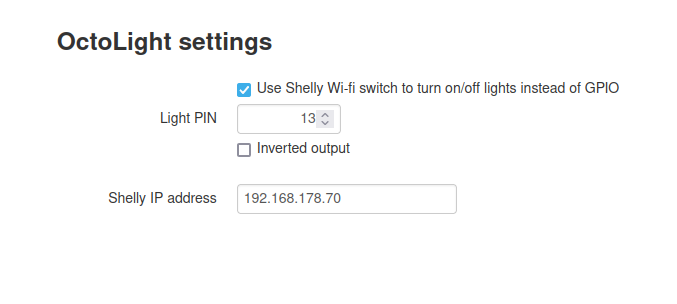

# OctoLight
A simple plugin that adds a button to the navigation bar for toggleing a GPIO pin on the Raspberry Pi.

## Setup
Install via the bundled [Plugin Manager](https://docs.octoprint.org/en/master/bundledplugins/pluginmanager.html)
or manually using this URL:

	https://github.com/gigibu5/OctoLight/archive/master.zip

## Configuration

Curently, you can configure settings:
- `Light PIN`: The pin on the Raspberry Pi that the button controls.
	- Default value: 13
	- The pin number is saved in the **board layout naming** scheme (gray labels on the pinout image below).
	- **!! IMPORTANT !!** The Raspberry Pi can only control the **GPIO** pins (orange labels on the pinout image below)
	

- `Inverted output`: If true, the output will be inverted
	- Usage: if you have a light, that is turned off when voltage is applied to the pin (wired in negative logic), you should turn on this option, so the light isn't on when you reboot your Raspberry Pi.

- `Setup Delay Turn off time`: This sets a time out for when the light will automatically turn its self off in an event
	- Default value: 5
	- Note: This value is in minutes

- `Setup Printer Events`: This allows you to select what you would like the light to do on a printer event
	- Default is nothing
	- Set the light to do nothing, turn on, turn off, or turn on then turn itself off after the delay time value

## API
Base API URL : `GET http://YOUR_OCTOPRINT_SERVER/api/plugin/octolight?action=ACTION_NAME`

This API always returns updated light state in JSON: `{state: true}`

_(if the action parameter not given, the action toggle will be used by default)_
#### Actions
- **toggle** (default action): Toggle light switch on/off.
- **turnOn**: Turn on light.
- **turnOff**: Turn off light.
- **getState**: Get current light switch state.
- **delayOff**: Turn on light and setup timer to shutoff light after delay time, note, `&delay=VALUE` can be added to the URL to override the default time value
- **delayOffStop**: Testing for shutting off timer and light

## TO DO
- [x] Update interface if Light is turned on or off

Maybe in the distant future:
- [x] Turn off on finish print
